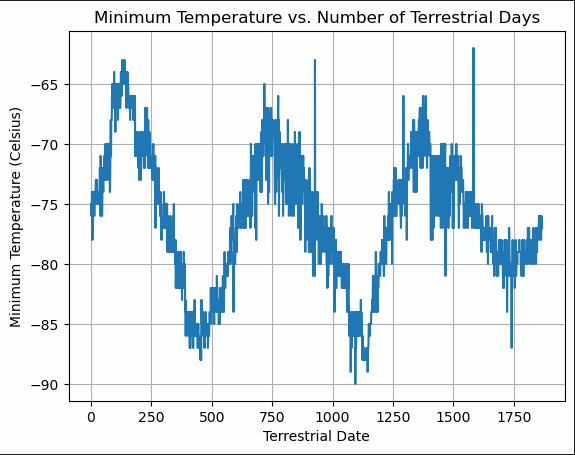

# Data-assignment-week11-data-collection-challenge
Refer to starter code file for python script and chart /csv file outputs.

## Part 1: Mars News

I was able to scrape the article titles and preview of the text in the part_1_mars_news code file, with the output displayed below.

## Part 2: Mars Weather

### How many months exist on Mars?
12 months

### How many Martian (and not Earth) days worth of data exist in the scraped dataset?
1867 days in the dataset.

### What are the coldest and the warmest months on Mars (at the location of Curiosity)? To answer this question:
### Find the average minimum daily temperature for all of the months
### Plot the results as a bar chart.

The average coldest temperatures for each month is summarised below and in the graph.

1    -77.160920

2    -79.932584

3    -83.307292

4    -82.747423

5    -79.308725

6    -75.299320

7    -72.281690

8    -68.382979

9    -69.171642

10   -71.982143

11   -71.985507

12   -74.451807

As you can see in the ordered graph, the 3rd and 4th moth have the average coldest temperature, whilst the 8th and 9th have the average warmest temperature.

### Which months have the lowest and the highest atmospheric pressure on Mars? To answer this question:
### Find the average daily atmospheric pressure of all the months.
### Plot the results as a bar chart.

The average atmospheric pressure each month is summarised below and in the graph. The 9th month has the highest average, whilst the 6th month has the lowest average.

1     862.488506

2     889.455056

3     877.322917

4     806.329897

5     748.557047

6     745.054422

7     795.105634

8     873.829787

9     913.305970

10    887.312500

11    857.014493

12    842.156627

### About how many terrestrial (Earth) days exist in a Martian year? To answer this question:
### Consider how many days elapse on Earth in the time that Mars circles the Sun once.
### Visually estimate the result by plotting the daily minimum temperature.

The distance from peak to peak is roughly 675 days, indicating this is the time it takes to circle the sun once.

## References

Data-assignment-week11-data-collection-challenge, Tutor Session with Khangwelo, personal communication (Zoom), March 10, 2024

OpenAI. (2024). ChatGPT (GPT-3.5 architecture.) [Computer software]. Retrieved March 10, 2024, from https://openai.com/chatgpt

University of Adelaide. (2023). 11-Data-Collection/2/Activities/06-Stu_Scraping_Mars_News. Retrieved from https://git.bootcampcontent.com/University-of-Adelaide/UADEL-VIRT-DATA-PT-12-2023-U-LOLC/-/tree/main/11-Data-Collection/2/Activities/06-Stu_Scraping_Mars_News?ref_type=heads

University of Adelaide. (2023). 11-Data-Collection/3/Activities/05-Stu_Mars_Facts_Scrape. Retrieved from https://git.bootcampcontent.com/University-of-Adelaide/UADEL-VIRT-DATA-PT-12-2023-U-LOLC/-/tree/main/11-Data-Collection/3/Activities/05-Stu_Mars_Facts_Scrape?ref_type=heads